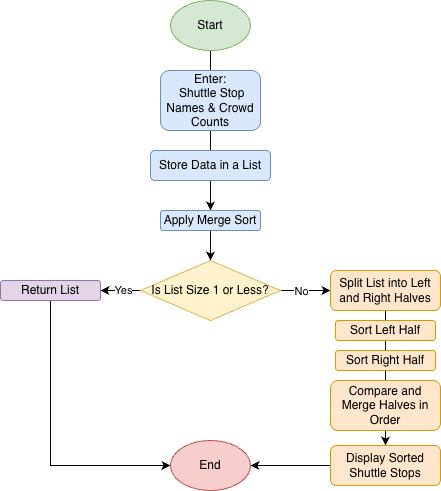
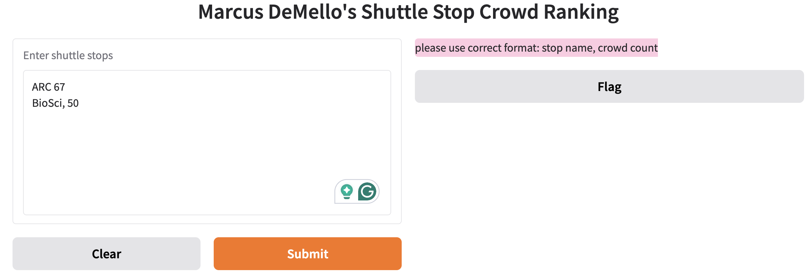
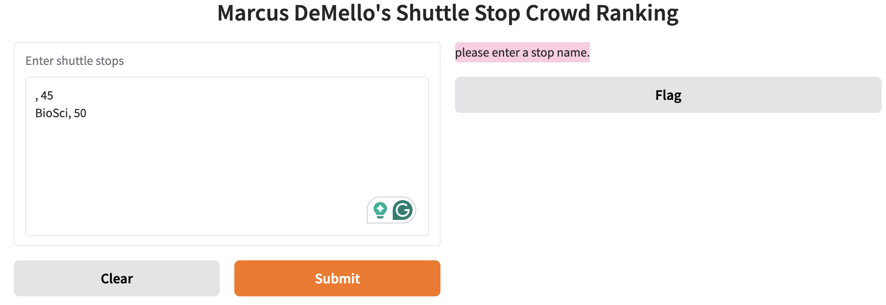
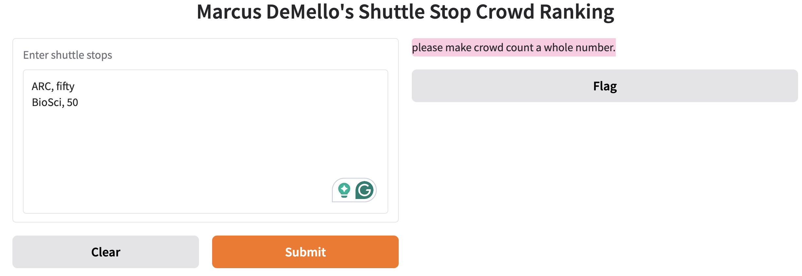
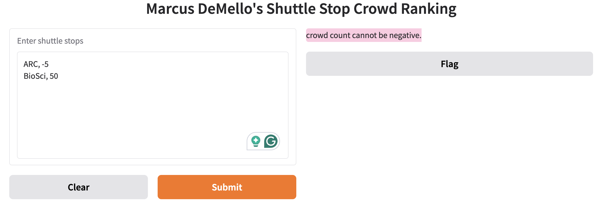

# Algorithm Name: Shuttle Stop Crowding Ranking using Merge Sort

### Chosen Problem:
I must organize shuttle stops based on how crowded they are. Each shuttle stop comes with a name and a crowd count. The goal is to sort the stops so that I can see which stops are the most crowded.

### Chosen Algorithm:
I've selected to go with Merge Sort.  It works by splitting a list into smaller parts, and then sorting those parts, and then merging them back together in order.  

### Why Merge Sort Fits the Problem
Each shuttle stop has a crowd count that can be compared easily, so merge sort fits the problem well.  It's also able to easily display how the list was sorted and merged, making it easy for users to understand the process.

### Assumptions & Preconditions
-shuttle stops have valid names

-each crowd count is an integer

-the list doesn't need to be sorted before running the algorithm

## Demo Screenshot

### Valid Input

## Problem Breakdown & Computational Thinking

### Decomposition:
-take the user input which includes stop names & crowd counts

-put that data into a list

-merge sort the list in order of crowd counts

-display each of the steps of the sorting process

-display the final sorted list

### Pattern Recognition:

-repeatedly splitting list into smaller ones

-compares elements and then merges them back in order

-continue until the full list is sorted

### Abstraction

-I only need to show the important steps such as splitting & merging

-hide things like memory or recursion depth

-focusing on how the list changes during sorting

### Algorithm Design

Input: shuttle stops and crowd counts

Process: 

-store data in list 

-sort into smaller parts 

-compare crowd counts

-merge lists back together in sorted order

Output: Sorted list of shuttle stops ranging lowest to highest crowd

### Flowchart

## Steps to Run

1. install python
2. install gradio using pip3 install gradio
3. run the program using: python3 app.py
4. open link from terminal
5. enter shuttle stops in correct format: name, number

## Hugging Face Link
https://huggingface.co/spaces/marcusdemello/shuttlesort

## Testing

With input that can be whatever the user wants, there are plenty of edge cases that need to be accounted for.  Each needs to be caught specifically so that the user knows their mistake and can adjust input.  Here are my tests:

#### Wrong Format
It's easy for the user to accidentally mess up the formatting of their input, so in this case we see what happens when they do.  The program catches that it was a format error, lets them know, and also provides the correct format guidelines.

#### Missing Stop Name
The program is able to handle a situation where the user doesn't input a name for a stop.  It specifically tells them to add one.

#### Not a Whole Number
If the user enters a number value that's either a word or a decimal, the program tells them to ensure their input includes a whole number.

#### Negative Number
In the case of a user inputting a negative population at one of the stops, the program is able to respond with their error.

#### Empty Input
If the user doesn't even input anything, the program can still let them know what their problem was.

## Author & AI Acknowledgment
Author: Marcus DeMello
AI Disclosure:  AI such as ChatGPT was used to debug code, help with structuring, help with efficiency, and provide new ideas.  All final changes, testing, and modifications were done by me.	
